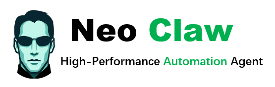

<div align="center">
  

# NeoClaw：你的一站式AI助手  

  

</div>

是时候让你掌控一切了，对吧？

这可不是开玩笑😉 NeoClaw 是一款基于Go 语言的高性能、可扩展的一站式AI Agent 框架，支持多 agent 协作、多渠道接入、Skill扩展和 Hook 系统。支持 CLI、QQ、飞书、钉钉、Telegram、Discord、企业微信等渠道接入。

## ✨ 特性

- 🤖 **多 Agent 协作** - 采用类似 AutoGen 的团队协作模式，Agent 可创建多agent 团队来分步解决复杂任务
- 📡 **多渠道接入** - 原生支持 CLI、QQ、飞书、钉钉、Telegram、Discord、企业微信等渠道
- 🛠️ MCP 客户端 - 实现基于 Stdio 传输层与 JSON-RPC 2.0 协议的客户端，自动管理外部工具列表的获取与调用，无缝对接生态
- 🧩 Skill 系统 - 兼容 AgentSkills 规范，支持多形式变量解析、热重载与超时输出截断，并通过 XML 格式将工具列表渐进式披露给 LLM 以优化上下文体积
- 🔌 **Hook 系统** - 内部 Go Hook + 外部脚本扩展（Python/Bash），支持用户定制自己的脚本，实现运行时控制和数据处理。可用于数据验证、权限控制、日志审计等场景。
- 🧰 **内置工具** - Web 搜索、URL 解析、文件读写、系统操作，团队创建等
- ⏰ **定时机制** - 支持设置定时任务，到时自动执行
- 🧠 **记忆管理** - 采取层级摘要压缩策略，将对话历史递归抽象为多层 Summary Node，使旧记忆高度概括而近期记忆保持细节
- 🎨 **TUI 界面** - 基于 Bubble Tea 的终端交互，支持丰富的对话内命令操作
- 📝 **结构化日志** - 基于zerolog + lumerjack 的高性能日志记录

## 🚀 快速开始

### 安装

#### Windows

```powershell
git clone https://github.com/seirok/neoclaw.git
cd neoclaw
go build -o brambleclaw.exe ./cmd/brambleclaw
```

#### macOS / Linux

```bash
git clone https://github.com/seirok/neoclaw.git
cd neoclawhttps://github.com/seirok/neoclaw.git
go build -o neoclaw ./cmd/neoclaw
```

### 配置

首次运行会自动创建配置文件：

- **Windows**: `%USERPROFILE%\.neoclaw\settings.json`
- **macOS / Linux**: `~/.neoclaw/settings.json`
- 启动前，请先设置好环境变量

#### Windows 环境变量

```powershell
$env:NEO_KEY="your-api-key"
$env:NEO_URL="https://api.example.com"
$env:NEO_MODEL="your model"
```

#### macOS / Linux 环境变量

```bash
export NEO_KEY="your-api-key"
export NEO_URL="https://api.example.com"
export NEO_MODEL="your model"
```

### 运行

#### Windows

```powershell
# 启动agent
.\brambleclaw.exe agent

# Debug 模式
.\brambleclaw.exe debug --lines 100
```

#### macOS / Linux

```bash
# 启动agent
./neoclaw agent

# Debug 模式
./neoclaw debug --lines 100
```

### 对话内命令


| 命令            | 说明                                     |
| --------------- | ---------------------------------------- |
| `/help`         | 列出所有可用命令和技能                   |
| `/context`      | 查看当前上下文使用情况（含可视化进度条） |
| `/compact`      | 手动触发上下文压缩                       |
| `/model [名称]` | 查看当前模型，或切换到指定模型           |
| `/skills`       | 列出所有可用技能及详情                   |
| `/undo`         | 撤销上一轮对话                           |
| `/clear`        | 创建新会话（保留旧会话记录）             |
| `/reset`        | 重置当前会话（清空消息，保留会话标识）   |
| `/resume`       | 恢复历史会话                             |
| `/delete`       | 删除历史会话                             |

## 🏗️ 架构设计

### 核心模块


| 模块       | 说明                                                       |
| ---------- | ---------------------------------------------------------- |
| `agent`    | ChatAgent 接口和 LLM 集成                                  |
| `runtime`  | Topic 发布订阅，Agent 运行时                               |
| `messages` | 消息类型系统                                               |
| `team`     | 多 Agent 团队协作                                          |
| `channel`  | 外部渠道集成（QQ/飞书/钉钉/Telegram/Discord/企业微信/CLI） |
| `skill`    | 技能系统（热加载）                                         |
| `hook`     | Hook 扩展系统                                              |
| `tools`    | 工具系统（Web Search/MCP 等）                              |
| `session`  | 会话管理和持久化                                           |
| `config`   | 配置管理                                                   |

### 已实现的渠道

Neoclaw 支持多种即时通讯平台，每个渠道都有完整的消息收发能力：


| 渠道         | 状态      | 文件位置                           | 特性                                                             |
| ------------ | --------- | ---------------------------------- | ---------------------------------------------------------------- |
| CLI          | ✅ 已实现 | `internal/channel/cli.go`          | 基于 Bubble Tea 的终端交互，支持丰富的对话内命令                 |
| QQ           | ✅ 已实现 | `internal/channel/qq.go`           | 支持群聊（@消息）、私聊、频道，WebSocket 连接，Markdown 消息     |
| Feishu       | ✅ 已实现 | `internal/channel/feishu.go`       | 飞书/Lark 机器人，支持交互式卡片，WebSocket 连接，Token 缓存刷新 |
| DingTalk     | ✅ 已实现 | `internal/channel/dingtalk.go`     | 钉钉 Stream 模式，支持 Markdown 消息                             |
| Telegram     | ✅ 已实现 | `internal/channel/telegram.go`     | 支持代理、群组/私聊，@提及检测，长消息自动分片，HTML 格式        |
| Discord      | ✅ 已实现 | `internal/channel/discord.go`      | 支持服务器/私聊，@提及检测，长消息自动分片                       |
| WeWork       | ✅ 已实现 | `internal/channel/wework.go`       | 企业微信 HTTP 回调，AES 消息加密，Token 自动刷新                 |
| WeWork WsBot | ✅ 已实现 | `internal/channel/wework_wsbot.go` | 企业微信 WebSocket 模式                                          |

### 渠道配置示例

所有渠道都通过统一的配置文件进行管理，首次运行会自动生成默认配置。主要配置项包括：

```json
{
  "channels": {
    "cli": {
      "enabled": true
    },
    "telegram": {
      "enabled": true,
      "token": "your-bot-token",
      "proxy": "http://localhost:7890",
      "allow_from": ["user1", "user2"]
    },
    "qq": {
      "enabled": true,
      "app_id": "your-app-id",
      "app_secret": "your-app-secret",
      "allow_from": ["user1"],
      "send_markdown": true
    },
    "feishu": {
      "enabled": true,
      "app_id": "your-app-id",
      "app_secret": "your-app-secret",
      "is_lark": false
    },
    "dingtalk": {
      "enabled": true,
      "client_id": "your-client-id",
      "client_secret": "your-client-secret"
    },
    "discord": {
      "enabled": true,
      "bot_token": "your-bot-token",
      "group_trigger": {
        "mention_only": true,
        "prefixes": ["!bot"]
      }
    },
    "wework": {
      "enabled": true,
      "corp_id": "your-corp-id",
      "secret": "your-secret",
      "agent_id": "your-agent-id",
      "token": "webhook-token",
      "encoding_aes_key": "aes-key",
      "webhook_port": 8766
    }
  }
}
```

## 🔌 Hook 系统

NeoClaw 提供强大的 Hook 扩展机制，支持内部 Go Hook 和外部脚本 Hook，让你可以灵活定制和扩展系统行为。

### 核心特性

- **双模式支持** - 内部 Go Hook（高性能）+ 外部脚本 Hook（灵活，支持 Python/Bash/Node.js 等）
- **流水线模式** - 多个 Hook 链式执行，数据可在 Hook 间传递和修改
- **优先级控制** - 通过优先级精细控制 Hook 执行顺序
- **配置驱动** - 支持 YAML 配置文件，无需重新编译
- **安全隔离** - 外部 Hook 在独立进程运行，超时、输出大小限制
- **丰富的 Hook 点** - Agent 生命周期、消息处理、LLM 请求、工具执行等

### Hook 类型

#### 1. 内部 Go Hook

在进程内直接执行，零开销，适合高性能场景：

```go
package hooks

import (
    "context"
    "neoclaw/internal/hook"
)

func MyHook(ctx context.Context, input any) (any, error) {
    // 你的逻辑
    data := input.(map[string]any)
    data["processed"] = true
    return data, nil
}

func init() {
    hook.Register("my.hook.point", MyHook)
}
```

#### 2. 外部脚本 Hook

使用脚本语言（Python/Bash 等）实现，无需重新编译：

```python
#!/usr/bin/env python3
import json
import sys

def main():
    request = json.loads(sys.stdin.read())
    data = request.get("data", {})
  
    # 业务逻辑
    if data.get("amount", 0) > 10000:
        response = {"decision": "deny", "message": "Too big!"}
    else:
        response = {"decision": "allow", "message": "OK"}
  
    print(json.dumps(response))
    sys.exit(0)

if __name__ == "__main__":
    main()
```

配置文件：

```yaml
version: "1.0"
defaults:
  timeout_ms: 5000
  working_dir: "./scripts"
definitions:
  - point: "order.before_save"
    type: "external"
    enabled: true
    config:
      command: "python3"
      script_path: "./audit_order.py"
```

### 三种决策类型

外部 Hook 支持三种决策：


| 决策     | 说明                 | 示例                                             |
| -------- | -------------------- | ------------------------------------------------ |
| `allow`  | 允许执行，数据不变   | `{"decision": "allow", "message": "OK"}`         |
| `deny`   | 拒绝执行，返回错误   | `{"decision": "deny", "message": "Rejected"}`    |
| `modify` | 允许执行，但修改数据 | `{"decision": "modify", "modified_data": {...}}` |

### 可用 Hook 点

NeoClaw 提供丰富的 Hook 点：


| 类别  | Hook 点示例                           | 说明           |
| ----- | ------------------------------------- | -------------- |
| Agent | `hook.point.agent.pre-start`          | Agent 启动前   |
| Agent | `hook.point.agent.create`             | Agent 创建后   |
| 消息  | `hook.point.message.pre-process`      | 消息处理前     |
| 消息  | `hook.point.message.pre-response`     | 发送响应前     |
| LLM   | `hook.point.llm.request`              | LLM 请求前     |
| LLM   | `hook.point.llm.response`             | LLM 响应后     |
| 工具  | `hook.point.tool.pre-execute`         | 工具执行前     |
| 工具  | `hook.point.tool.result`              | 工具结果后     |
| MCP   | `hook.point.mcp.tool.pre-execute`     | MCP 工具执行前 |
| 沙箱  | `hook.point.sandbox.command.validate` | 沙箱命令验证   |

### 快速开始

#### 1. 运行示例

```bash
cd neoclaw
go run examples/main.go
```

#### 2. 创建你的第一个 Hook

参考 `examples/` 目录下的示例：

- `examples/hooks/` - 内部 Hook 示例
- `examples/scripts/` - 外部 Hook 示例
- `examples/config/hooks.yaml` - 配置示例

### 文档

完整的 Hook 开发文档请参阅：

- 📖 **Hook 定制开发指南** - `docs/hooks/hook-customization-guide.md`
- 📋 **Hook 快速参考** - `docs/hooks/hook-cheatsheet.md`
- 📚 **Hook 使用文档** - `docs/hooks/hook-usage.md`
- 📝 **Hook 点列表** - `docs/hooks/hook-points.md`

---

## 📄 许可证

MIT License
